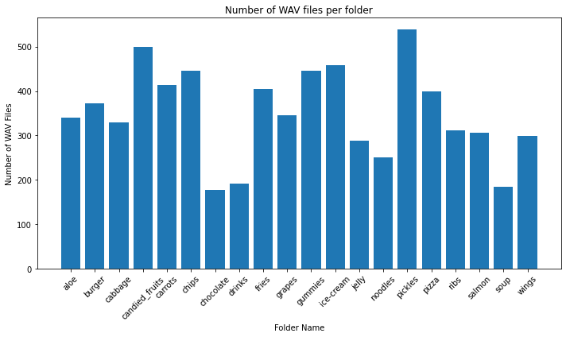
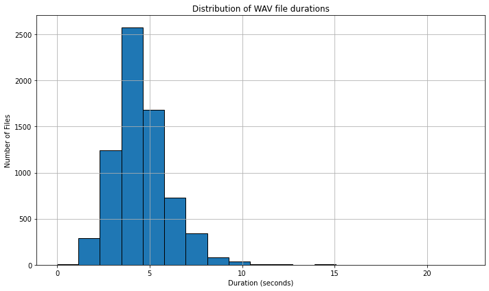
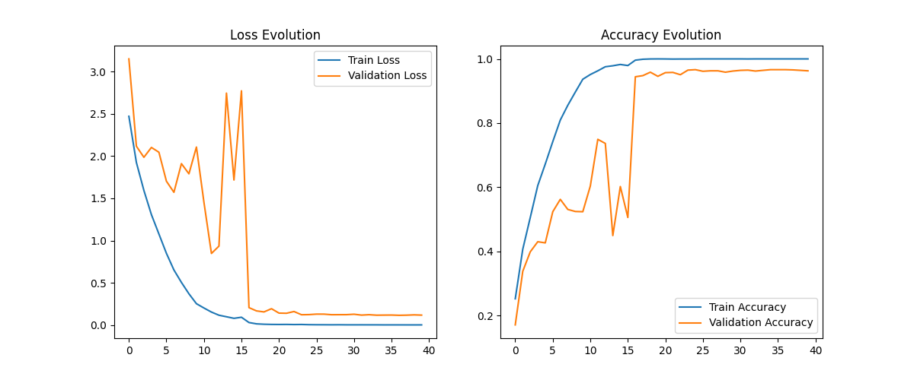
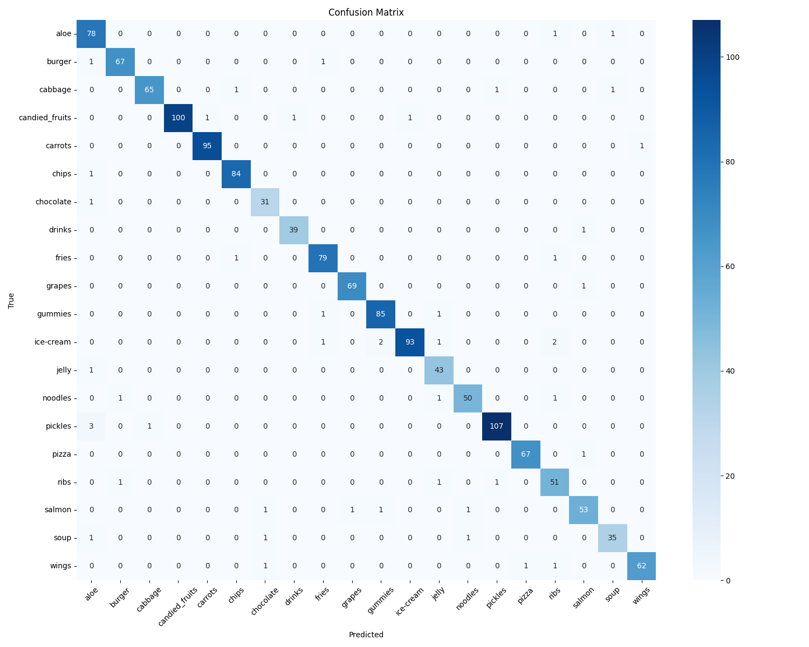
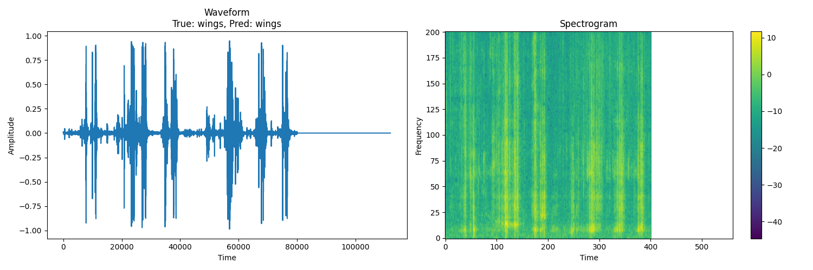
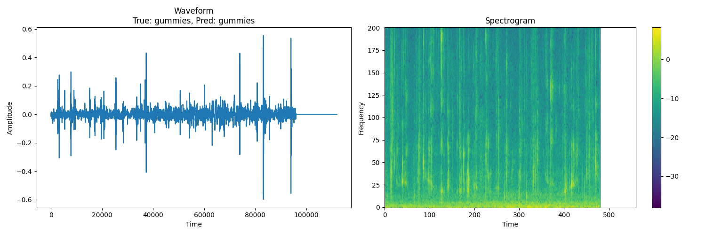
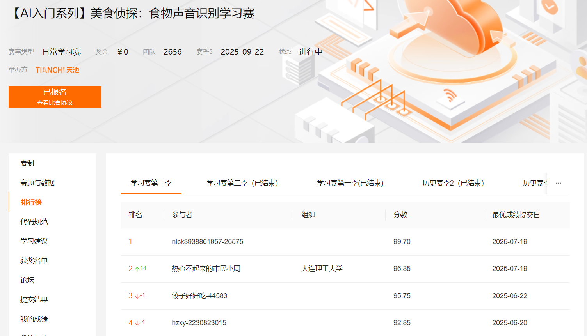

# **食物声音分类项目**


## 项目介绍

本项目使用深度学习模型对食物相关的声音进行分类，能够识别20种不同的食物类别。主要功能包括：

- 音频预处理和特征提取（梅尔频谱图）

- 数据增强（时域拉伸、频谱增强）

- 基于CNN14架构的深度学习模型训练

- 模型验证和性能评估


本次项目源于：[[AI入门系列]美食侦探：食物声音识别学习赛 (aliyun.com)](https://tianchi.aliyun.com/competition/entrance/531887/information))

数据集下载：

[Eating_Sound (kaggle.com)](https://www.kaggle.com/datasets/rexinshiminxiaozhou/eating-sound)


## 文件夹结构 

```makefile
Food_Recognition/
├── data/               # 数据集文件夹
    ├── train/          # 训练集音频文件
├── log/                # 训练记录文档
├── output/             
    ├── pic/            # 输出图片文件夹
    ├── model/          # 训练模型文件夹
    ├── samples/        # 测试样例输出文件夹
        ├── sample_0_spectrogram.png       # 0号测试样例音频图
        ├── sample_0_wings_pred_wings.wav  # 0号测试样例原音频（文件名中包含原始和预测标签）
        	...
    ├── class_mapping.json          # 类别映射文件
    ├── classification_report.txt   # 分类结果报告
├── train.py            # 主训练
├── predict.py          # 预测
├── data.ipynb          # 数据分析jupyter notebook
├── requirements.txt
└── README.md
```


## 数据集介绍
数据集包含20类食物相关的声音，总体7000个WAV格式音频文件，采样率16kHz，最长时长为22秒，平均时长为4.53秒。音频时长、音频个数、分类的分布关系如下图所示（更多信息可查看*data.ipynb* 或自行研究数据集）：





根据音频数据的时长分布图可以看出，85%以上的音频长度在7秒及以下，所以我们此处选择7s作为我们的输入长度


## 模型架构与原理

### CNN14 架构
模型采用深度卷积神经网络结构，包含5个卷积块和2个全连接层：

1. 卷积块 ：每块包含2个卷积层+BN+ReLU，后接最大池化
   
   - 通道数逐块增加(64→128→256→512→1024)
   - 使用3×3小卷积核保持局部特征
   - 批归一化加速收敛
2. 频谱处理 ：
   
   - 输入为128维梅尔频谱图
   - 时频域数据增强策略：
     - 复数域时域拉伸(0.8-1.2倍速)
     - 频谱掩蔽(频率/时间掩蔽)
     - 随机增益(-6dB到+6dB)
3. 分类头 ：
   
   - 全局平均池化→Dropout(0.5)
   - 1024→512全连接→ReLU
   - Dropout(0.5)→20类输出
   
   

## 快速开始

```bash
# 安装依赖
pip install -r requirements.txt

# 训练模型
python train.py
```


## 结果展示

训练损失记录如下：




项目中使用 **准确率（Accuracy）**衡量结果的准确性

在划分的验证集上得到的混淆矩阵如下：



随机测试五个样本（此处简单展示两个）查看音频波形输出图像：

<audio src="./output/samples/sample_0_wings_pred_wings.wav"></audio>



<audio src="./output/samples/sample_2_gummies_pred_gummies.wav"></audio>




战绩可查 ∠( ᐛ 」∠)_：



